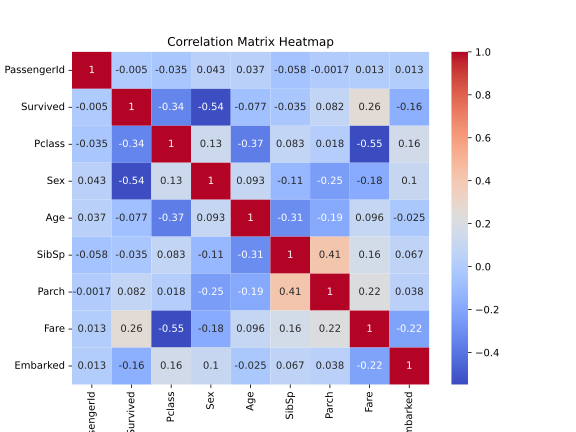
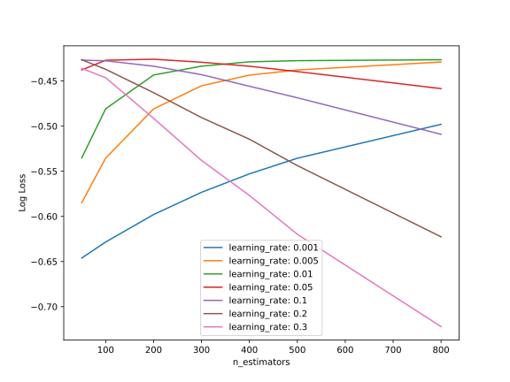

# Titanic - Machine Learning from Disaster

## A Kaggle competition to predict survival on the Titanic and get familiar with ML basics

## Feature engineering

Some features are clearly more correlated with survival than others (e.g. sex and class are highly correlated).
First, I decided to remove certain features:
    * Name: the name of passengers is not deterministic of their survival. Although we might be able to extrapolate the wealth of passengers, it seems overly complicated, and would lead to useless results since we already know the passengers' class. 
    * Ticket: same applies to the ticket number.
    * Cabin: the cabin data is not really useful.

To verify my initial thoughts, I created this heatmap, which shows that Pclass, Sex, Fare and Embarked are the most correlated features.

## Algorithm
To predict the survival of Titanic passengers, we should consider this as a classification problem. A well-known and good algorithm for this kind of tasks is Random Forest.
We obtain the following result using this algorithm: 0.77751% accuracy.

Therefore, I decided to move on Gradient Boosting classifier algorithm, did a grid search and find good hyper-parameters to get a 0.79186% accuracy.
